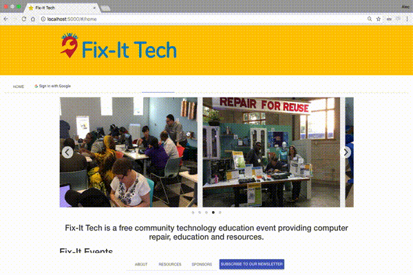

# Fix-It App

Fix-It Tech is a full-stack web application to schedule events and manage attendance. Volunteers will register their skills and RSVP to events, which will allow administrators to match volunteers to problems and accurately schedule volunteers for upcoming events. The application will be primarily an admin-orientated application with ambitions to be more public facing in the future.

## Technologies Used

- AngularJS
- Node
- Express
- PostgreSQL
- HTML5
- CSS3
- Angular Material
- Bootstrap
- Google OAuth 2.0
- Passport
- SweetAlert2
- X-editable
- Heroku

## Getting Started

These instructions will get you a copy of the project up and running on your local machine for development and testing purposes. See deployment for notes on how to deploy the project on a live system.

### Prerequisites

Link to software that is required to install the app.

- [Node.js](https://nodejs.org/en/)

### Installing

1. Run '$npm install' in the terminal.
2. Use the databaseSetup.sql file to create the necessary tables.
3. Create a duplicate of the '.config-dist.js' file and rename it '.config.js'.
4. In the '.config.js' add in your own database and google authentication details.
5. Run '$npm start' to run the server.

## Screen Shot

Home Page.

Admin Demo.

## Documentation
Below is a link to our project scope.
https://docs.google.com/document/d/1dqJH1ZG9PkyO95eMTMDAE5pyidpfBhcKZgUZenO5Ops/edit?usp=sharing

### Stretch Goals

Features that you would like to add at some point in the future.

- [ ] Feature

## Deployment

Add additional notes about how to deploy this on a live system

## Authors

Alec Sands, Anne Kennedy, Ben Haesemeyer, and Emily Kuplic.
